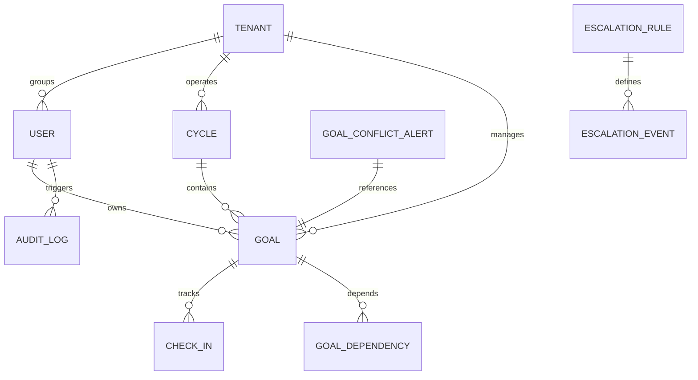

# GoalForge — Enterprise System Architecture Document

## 1. Executive Summary & The Novelty Idea

### The Novelty: Proactive Growth & Cognitive Alignment
GoalForge moves goal-tracking from a reactive, annual HR compliance exercise into a **proactive, cognitive alignment ecosystem**. Traditional platforms act as passive digital ledgers. GoalForge acts as an active organizational health engine, introducing:
1. **Negotiated Alignment:** Managers can inline-edit, refine, and calibrate weightages/targets directly during the approval stage, shifting the process from top-down mandates to a constructive negotiation.
2. **Cognitive Guardrails (Burnout Protection):** Check-in updates are parsed in real-time by a sentiment analysis engine. An unexpected dip in manager/employee narrative alignment flags early-stage burnout or systemic friction before key results fail.
3. **Cross-Department Conflict Alerting:** High-level analytics scan departmental OKRs to identify structural contradictions (e.g., standardizing prototyping velocity while simultaneously enforcing aggressive cloud infrastructure cost cuts).

---

## 2. Cloud-Native Production Architecture ($0-Cost Stack)

GoalForge has transitioned from a local Docker Compose setup to a highly optimized, fully distributed, zero-cost production cloud architecture.

```mermaid
graph TD
    %% Presentation Tier
    UserBrowser["User Browser (HTTPS)"]
    Vercel["Vercel CDN (Edge Servers)<br/>React + Vite Frontend"]
    
    %% Compute Tier
    HF_Backend["Hugging Face Space (Docker)<br/>Express API Gateway Gateway"]
    HF_ML["Hugging Face Space (Docker)<br/>FastAPI Analytics & Sentiment"]
    
    %% Data Tier
    Neon_DB[("Neon Serverless Database<br/>PostgreSQL 15")]
    
    %% Routing Paths
    UserBrowser -->|HTTPS| Vercel
    UserBrowser -->|API Requests / JWT| HF_Backend
    HF_Backend -->|Internal REST Calls| HF_ML
    HF_Backend -->|Prisma Client (SSL)| Neon_DB
    HF_ML -->|Dynamic Queries| Neon_DB

    classDef presentation fill:#f43f5e,stroke:#333,stroke-width:2px,color:#fff;
    classDef compute fill:#3b82f6,stroke:#333,stroke-width:2px,color:#fff;
    classDef data fill:#10b981,stroke:#333,stroke-width:2px,color:#fff;
    
    class Vercel presentation;
    class HF_Backend,HF_ML compute;
    class Neon_DB data;
```

### 2.1 Presentation Tier (Vercel Edge)
* **Framework:** React 18, Vite-compiled single page application (SPA).
* **State Management:** Zustand, providing an immutable, fast-rendering global authentication and navigation state.
* **Styling System:** Modern custom CSS framework built on design tokens (vibrant dark-modes, modern layout grids).
* **Connection Security:** Employs Axios Interceptors to inject JWT Access tokens in HTTP headers, automatically handling silent token refreshes via HTTP-only secure cookies (`goalforge_refresh_token`).

### 2.2 Core Application Tier (Hugging Face Backend)
* **Engine:** Express.js API gateway, fully written in strict TypeScript.
* **Containerization:** Deployed via a customized alpine-linux Docker container optimized for fast boot-ups, binding port `7860` under Hugging Face's reverse proxy.
* **Authentication Service:** State-of-the-art token security using a double-JWT implementation (15-minute `JWT_SECRET` Access token + 7-day `JWT_REFRESH_SECRET` Refresh token).
* **Rules Engine:** Dynamic controllers enforcing data invariants:
  * Strict timeline validation checking active quarters (Q1–Q4) against cycle limits.
  * Zod-validated input schemas securing database updates from bad weightages (>100%).

### 2.3 Machine Learning Tier (Hugging Face ML Space)
* **Engine:** Python 3.10, FastAPI, running with the Uvicorn web server.
* **NLP Analysis:** Hugging Face model pipelines executing sentiment analysis and token categorization on check-in commentary.
* **Integration:** Connects strictly back to the Node.js API over secure internal HTTP calls to feed data into the front-end dashboard metrics.

### 2.4 Serverless Data Tier (Neon PostgreSQL)
* **Engine:** PostgreSQL 15 running on Neon Serverless.
* **Scale-to-Zero:** Autoscaling serverless compute instantly scales down to 0 active cores during periods of organizational inactivity to maintain zero-cost deployment, ramping back up in under 500ms on request.
* **ORM:** Prisma Client with connection pooling (`sslmode=require`), providing compiled type-safe TypeScript interfaces matching database transactions.

---

## 3. Novel Core Features & Technical Workflows

### 3.1 Inline Negotiation & Validation (NEW)
* **Workflow:** During goal validation, the Manager can intercept a pending draft and perform inline modifications on `target` values and `weightage` fields directly on the **Approvals Page**. 
* **Database Guardrails:** When the Manager submits the approval request, Zod schemas ensure cumulative employee goal weightage does not violate the strict 100% threshold.

### 3.2 Hierarchical Shared Goals Synchronization (FIXED)
* **Cascading Transactions:** When a parent shared goal's progress is updated, a deep SQL transaction is initiated via Prisma.
* **Synchronization Hook:**
  ```mermaid
  sequenceDiagram
      participant Manager
      participant Parent Goal
      participant Child Goals
      participant DB
      
      Manager->>Parent Goal: Update Progress (Check-in)
      Parent Goal->>DB: Write Parent Check-In (actualValue, progressScore)
      Note over Parent Goal, Child Goals: Sync Hook Triggers
      DB-->>Child Goals: Query where parentGoalId = parent.id & isShared = true
      Child Goals->>DB: Cascade exact same actualValue, progress, & completionDate
      DB-->>Manager: Confirm nested synchronization across full hierarchy
  ```
* **RBAC Restrictions:** Inherited child goals are marked as read-only (`isShared = true`) for target employees. Only the parent owner (Manager) can write directly to the check-in nodes.

### 3.3 Sentiment & Burnout Intelligence
* **Comment Parsing:** When a check-in is logged, the FastAPI model evaluates the manager's comment.
* **Friction Flagging:** Negative sentiment scores (<0.1) trigger an alignment warning in the HR/Executive dashboard, indicating potential breakdown in objective feasibility.

### 3.4 Unit of Measurement (UoM) Unified Progress Engine
GoalForge features a completely unified, reconciled Progress Calculation Engine across client and server:
* **MIN (Increase-to-Target):** 
  $$\text{Progress} = \frac{\text{Actual}}{\text{Target}} \times 100$$
* **MAX (Decrease-to-Target):** Used for reducing metrics (errors, costs).
  $$\text{Progress} = \frac{\text{Target} - \text{Actual}}{\text{Target}} \times 100$$
* **TIMELINE:** Linear evaluation comparing the completion date against the goal's target date.
* **ZERO (Maintenance Objective):** Binary evaluation (0 = 100%, >0 = 0% or vice versa).

---

## 4. Entity Relationship (Database Schema)



* **Tenant:** Supports multi-tenant organizational structure with custom branding palettes.
* **User:** Tracks roles (`Role.ADMIN`, `Role.MANAGER`, `Role.EMPLOYEE`) and departmental reporting tree (`managerId` self-relation).
* **Goal:** Core objective container holding target values, weightages, cascading links (`parentGoalId`), and AI tags.
* **CheckIn:** Individual quarterly milestones tracking numeric values and sentiment telemetry.

---

## 5. Enterprise Integrations & Reporting (BONUS Features)

### 5.1 OIDC Authentication via Microsoft Entra ID
* User schemas support unified login. When OIDC triggers, the backend hooks into Active Directory profiles using `microsoftEntraId` and maps corporate directory permissions dynamically to local database roles.

### 5.2 Outbound Webhook Integrations
* High-volume events (`goal.created`, `checkin.updated`, `risk.detected`) emit encrypted JSON payloads directly to external corporate ERP or workspace endpoints (e.g. Slack/Teams Connectors).

### 5.3 Achievement Report Export Service (NEW)
* Exposes `/api/reports/achievement/export` using automated backend formatting engines to output live CSV/Excel tabular streams for executive auditing.

---

## 6. Zero-Cost Scaling & Security Blueprint

| Vector | Production Status | Next-Stage Scaling |
|---|---|---|
| **API Gateway** | 🟢 Locked behind Hugging Face SSL proxy; CORS strictly bounded to Vercel production URL. | Add Redis key-value caching layer to prevent API-throttling on heavy dashboard loads. |
| **Compute Scaling**| 🟢 Scale-to-Zero serverless database logic + containerized sleep timeouts for maximum cost protection. | Set up a persistent cron trigger to prevent container sleep during working hours. |
| **Database Security**| 🟢 SSL connections enforced; Prisma-layer parameters protect against SQL injection. | Schedule automated snapshots using Neon's branching technology. |
